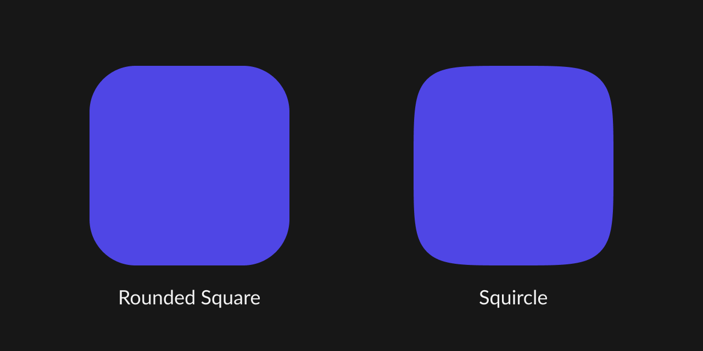

# Figma Squircle

[](https://npm.im/figma-squircle) [](./LICENSE)

> Figma-flavored squircles for everyone

## Disclaimer

> This library is not an official product from the Figma team and does not guarantee to produce the same results as you would get in Figma.

## What is this?

Figma has a great feature called [corner smoothing](https://help.figma.com/hc/en-us/articles/360050986854-Adjust-corner-radius-and-smoothing), allowing you to create rounded shapes with a seamless continuous curve (squircles).



This library helps you bring those squircles to your apps.

## Installation

```sh
yarn add figma-squircle
```

or

```sh
npm install figma-squircle
```

## Usage

```jsx
import { getSvgPath } from 'figma-squircle'

const svgPath = getSvgPath({
  width: 200,
  height: 200,
  cornerRadius: 24, // defaults to 0
  cornerSmoothing: 0.8, // cornerSmoothing goes from 0 to 1
})

const svgPath = getSvgPath({
  width: 200,
  height: 200,
  cornerRadius: 24,
  cornerSmoothing: 0.8,
  // You can also adjust the radius of each corner individually
  topLeftCornerRadius: 48,
})

// svgPath can now be used to create SVG elements
function PinkSquircle() {
  return (
    <svg width="200" height="200" xmlns="http://www.w3.org/2000/svg">
      <path d={svgPath} fill="pink" />
    </svg>
  )
}

// Or with the clip-path CSS property
function ProfilePicture() {
  return (
    <div
      style={{
        width: 200,
        height: 200,
        clipPath: `path('${svgPath}')`,
      }}
    >
      ...
    </div>
  )
}
```

## Squircle Params

### cornerSmoothing

> `number`

Goes from 0 to 1, controls how smooth the corners should be.

### cornerRadius

> `number` | defaults to `0`

### topLeftCornerRadius

> `number`

### topRightCornerRadius

> `number`

### bottomRightCornerRadius

> `number`

### bottomLeftCornerRadius

> `number`

### width

> `number`

### height

> `number`

## Thanks

- Figma team for publishing [this article](https://www.figma.com/blog/desperately-seeking-squircles/) and [MartinRGB](https://github.com/MartinRGB) for [figuring out all the math](https://github.com/MartinRGB/Figma_Squircles_Approximation) behind it.
- [George Francis](https://github.com/georgedoescode) for creating [Squircley](https://squircley.app/), which was my introduction to squircles.

## Related

- https://github.com/tienphaw/react-native-figma-squircle
